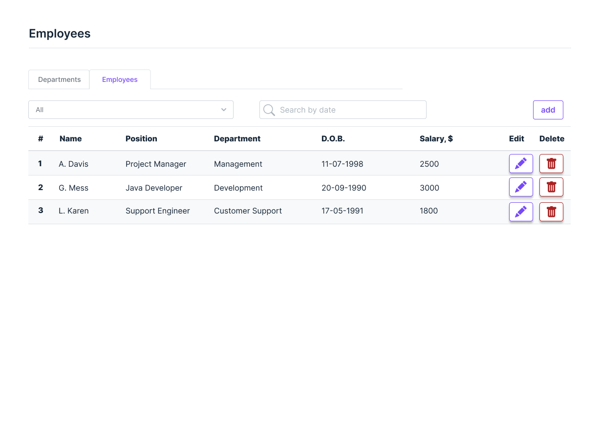
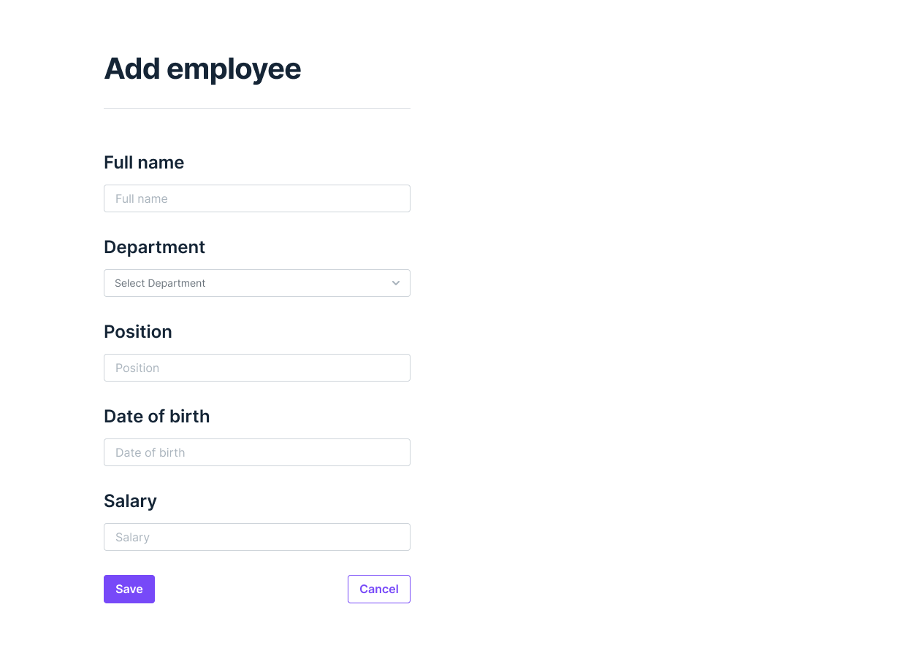
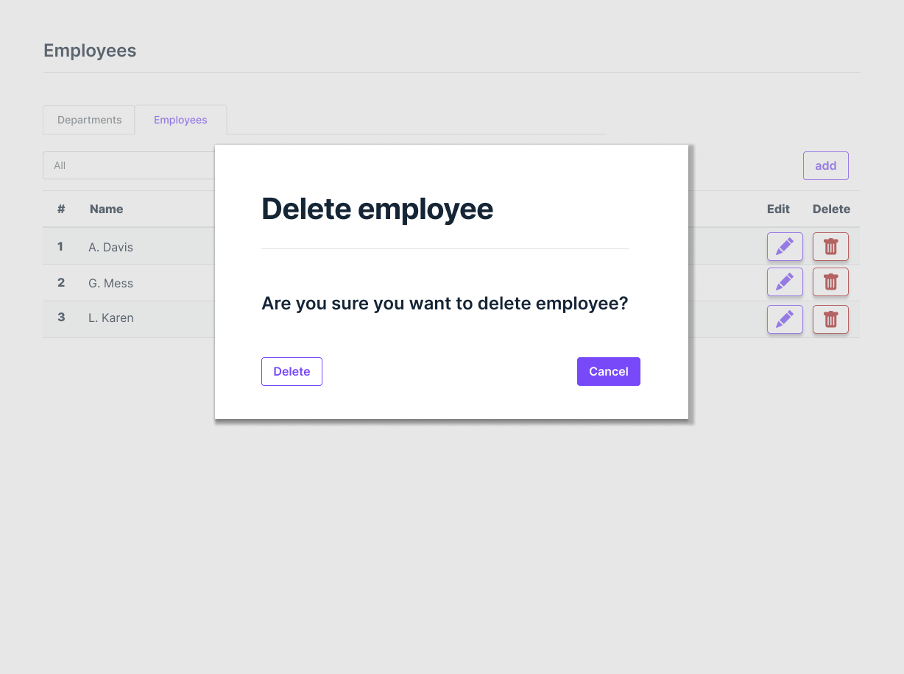
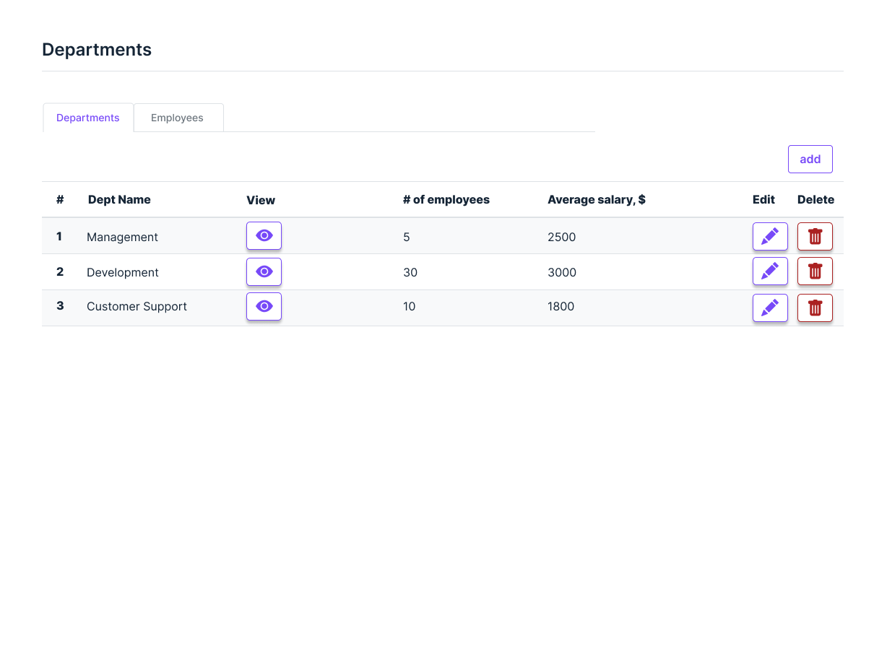
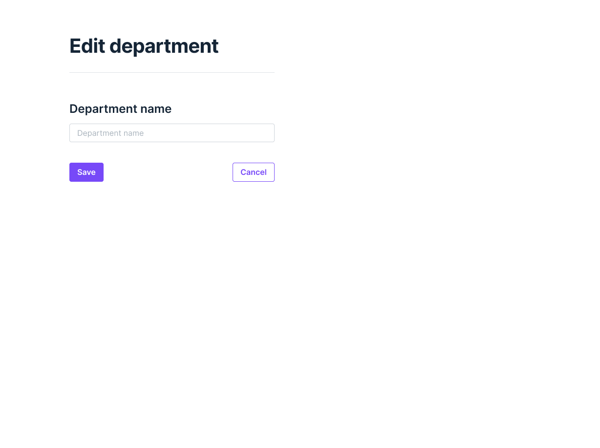
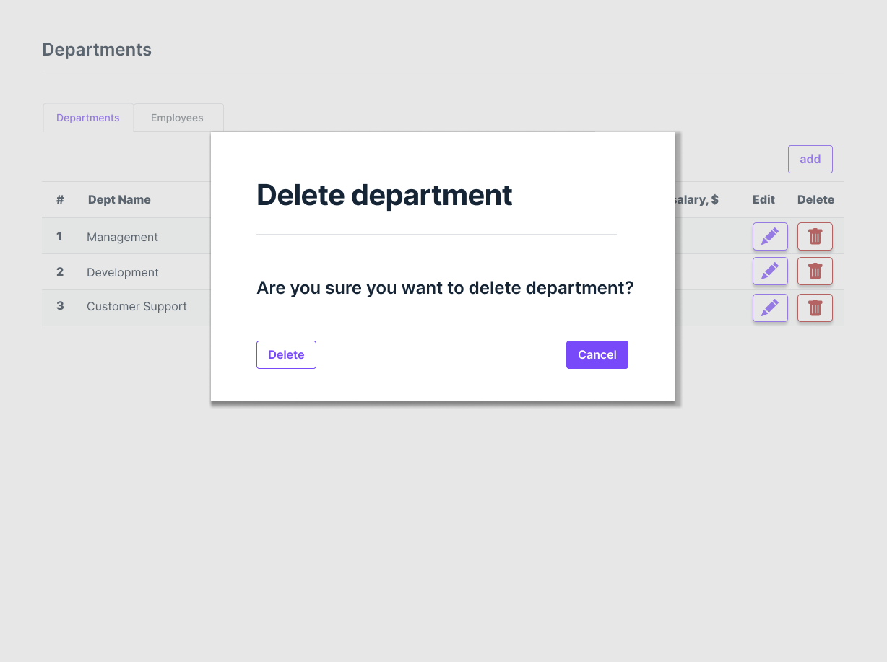

Employees web application SRS
=============================

Vision
------

Employees is a web application which allows managing human resources within a company.

Functionality includes managing departments of the company, assigning employees to departments, and storing detailed information about each employee.

Application should provide following features:

1.  Display a list of departments of the company and the average salary (calculated automatically) for these departments.
2.  Manage (add / edit / delete) departments.
3.  Display a list of employees in the departments with an indication of the salary for each employee and a search field to search for employees born on a certain date or in the period between dates
4.  Manage (add / edit / delete) employees.

1.  Employees
    ---------
    

### 1.1 Display list of employees.

Page is designed to display the list of employees.

Main scenario:

*   User clicks on Employees tab
*   App displays list of employees

Pic 1.1 Employees list

The list of employees is displayed in a table with following columns:

1.  Number.
2.  Name.
3.  Position.
4.  Department.
5.  Date of birth.
6.  Salary.
7.  “Edit employee” button.
8.  “Delete employee” button.

To filter employees by department, the user has to click on the “Department” drop down menu and select the department, or All to display all employees.

To search employees by the date of birth. User has to click in the Search field and select the birth date or date range.

To add new, edit or delete an employee corresponding buttons should be used.

1.2 Add an employee.

Main scenario:

*   User clicks the “Add” button in the Employees page;
*   Application displays form to enter new employee’s data;
*   User enters data and presses “Save” button;
*   If any data is entered incorrectly, incorrect data messages are displayed;
*   If entered data is valid, then record is saved to the database;
*   If error occurs, then error toast message is displaying;
*   If a new employee is successfully added, a list of employees should refresh to display new data.

Cancel operation scenario:

*   User clicks the “Add” button in the Employees page;
*   Application displays form to enter new employee’s data;
*   User enters data and presses “Cancel” button;
*   Data is not saved in the database, then the Employees page is displayed.

Pic 1.2 Add employee

To add new employee, following data fields should be filled:

*   Full name
*   Department
*   Position
*   Date of birth - select from the calendar widget
*   Salary

Constraints for data validation:

*   Full name     – maximum length of 90 characters;
*   Department  – maximum length of 90 characters;
*   Position  – maximum length of 90 characters;
*   Date of birth  – date format dd/mm/yyyy.
*   Salary - integer XXXXXX

### 1.3 Edit employee

Main scenario:

*   User clicks the “Edit” button in the Employees page;
*   Application displays form to edit employee’s data;
*   User enters data and presses “Save” button;
*   If any data is entered incorrectly, validation error messages are displayed;
*   If entered data is valid, then record is saved to the database;
*   If error occurs, then error toast message is displaying;
*   If an employee is successfully saved, a list of employees should refresh to display new data.

Cancel operation scenario:

*   User clicks the “Edit” button in the Employees page;
*   Application displays form to edit employee’s data;
*   User enters data and presses “Cancel” button;
*   Data is not saved in the database, then the Employees page is displayed.

Pic 1.3 Edit employee

Constraints for data validation:

*   Full name     – maximum length of 90 characters;
*   Department  – maximum length of 90 characters;
*   Position  – maximum length of 90 characters;
*   Date of birth  – date format dd/mm/yyyy.
*   Salary - integer XXXXXX

### 1.4 Delete employee

​​Main scenario:

*   The user, while on the Employees page, presses the "Delete" button in the selected line;
*   If the Employee can be removed, a confirmation dialog is displayed;
*   The user confirms the removal;
*   Record is deleted from database;
*   If error occurs, then error message displays;
*   If the record is successfully deleted, an Employees page should refresh to display updated data.

Pic. 1.4 - Delete employee

Cancel operation scenario:

*   User is on the Employees page and presses the “Delete” button; Application displays confirmation dialog “Are you sure you want to delete...?”;
*   User press “Cancel” button;
*   An Employee page without changes is displayed.

2\. Departments.
----------------

Page is designed to view, edit, add or delete Departments.

Main scenario:

*   User selects tab “Departments”;
*   Application displays list of Departments.

Pic 2.1 Departments list

The list of Departments is displayed in a table with following columns:

1.  Number.
2.  Department name.
3.  “View” button - transfers to the Employees page and shows employees of the selected department .
4.  \# of employees in this department.
5.  Average salary - calculated automatically.
6.  Edit button.
7.  Delete button.

To add new, edit or delete a Department corresponding buttons should be used.

2.2 Add a Department.

Main scenario:

*   User clicks the “Add” button in the Departments page.
*   Application displays form to enter new department’s data.
*   User enters data and presses the “Save” button.
*   If any data is entered incorrectly, incorrect data messages are displayed.
*   If entered data is valid, then the record is saved to the database.
*   If an error occurs, then an error toast message is displayed.
*   If a new department is successfully added, a Departments page should refresh to display new data.

Cancel operation scenario:

*   User clicks the “Add” button in the Departments page;
*   Application displays form to enter new department’s data;
*   User enters data and presses “Cancel” button;
*   Data is not saved in the database, then the Departments page is displayed.

Pic 2.2 Add department.

To add new department, following data fields should be filled:

*   Department name

Constraints for data validation:

*   Department  – maximum length of 90 characters.

### 2.3 Edit department

Main scenario:

*   User clicks the “Edit” button in the Department’s page;
*   Application displays form to edit department data;
*   User enters data and presses “Save” button;
*   If any data is entered incorrectly, validation error messages are displayed;
*   If entered data is valid, then record is saved to the database;
*   If error occurs, then error toast message is displaying;
*   If a department is successfully saved, a Department page should refresh to display new data.

Cancel operation scenario:

*   User clicks the “Edit” button in the Department’s page;
*   Application displays form to edit department data;
*   User enters data and presses “Cancel” button;
*   Data is not saved in the database, then the Department page is displayed.

Pic 2.3 Edit department.

Constraints for data validation:

*   Department  – maximum length of 90 characters.

### 2.4 Delete department

​​Main scenario:

*   The user, while on the Departments page, presses the "Delete" button in the selected line;
*   If the department can be removed, a confirmation dialog is displayed;
*   The user confirms the removal;
*   Record is deleted from database;
*   If error occurs, then error message displays;
*   If the record is successfully deleted, a Departments page should refresh to display updated data.

Prerequisite:

*   Only departments with no employees can be deleted

Cancel operation scenario:

*   User is on the Departments page and presses the “Delete” button; Application displays confirmation dialog “Are you sure you want to delete...?”;
*   User press “Cancel” button;
*   An Departments page without changes is displayed.

3\. Requirements.
-----------------

### 3.1 Non-functional requirements

*   The web application should use RESTful web service for CRUD operations.
*   The web application should be deployable on Gunicorn using the command line.
*   Test coverage: all public functions / methods on all levels should include unit tests.
*   Debug information should be displayed at the debugging level in the console and in a separate file.
*   Classes and functions / methods must have docstrings comments.
*   Documentation: finalize README file which should contain a brief description of the project, instructions on how to build a project from the command line, how to start it, and at what addresses the Web service and the Web application will be available after launch.